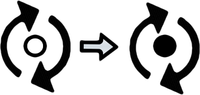

Calendar
---

Calendar that keeps events.

How to create development environment
---


1. Install [LiveReload Chrome plugin](https://chrome.google.com/webstore/detail/livereload/jnihajbhpnppcggbcgedagnkighmdlei).

2. Install `node` and `npm` via your system package manager (apt/yum/port/homebrew).

3. Install grunt.

3. Download dependencies to `node_modules` and `bower_components`:
  ```
npm install
grunt
```

3. Click on the plugin icon on the Calendar page to enable auto reload after any changes in source code:

